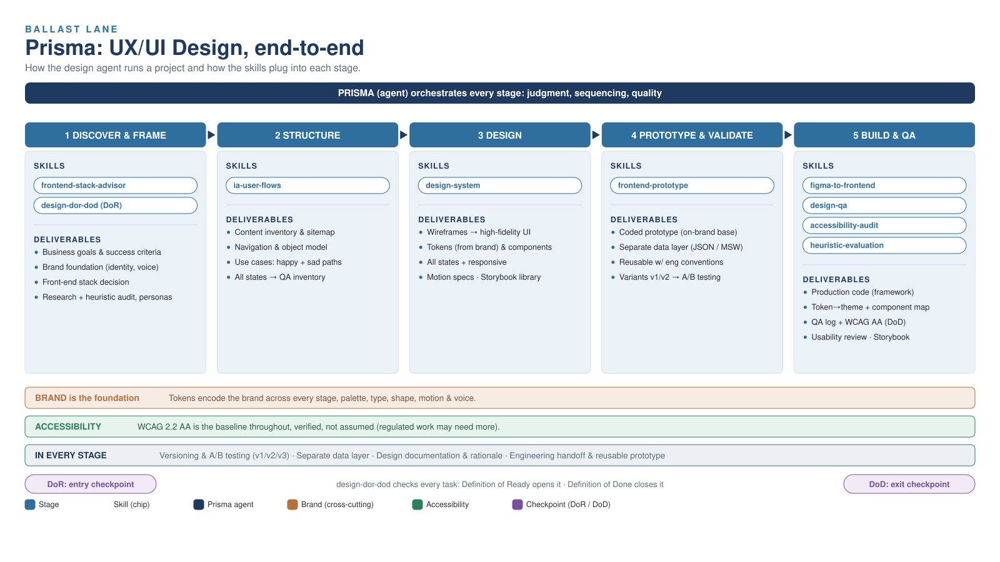

# Prisma — UX/UI Design Agent

Prisma is Ballast Lane's UX/UI design agent: a senior design partner that
covers the full product design lifecycle (discovery, information
architecture, flows, wireframes, high-fidelity UI, motion, design system,
documentation, QA, and developer handoff). This repository is the toolkit
the design team uses inside Claude Code / Cowork: the agent, its skills, and
the human-readable playbook that documents the same standards.

## Repository structure

```
.
├── agents/
│   └── prisma.md                # Prisma agent definition
├── skills/                      # 9 invocable skills, one folder per skill
│   ├── accessibility-audit/
│   ├── design-dor-dod/
│   ├── design-qa/
│   ├── design-system/
│   ├── figma-to-frontend/
│   ├── frontend-prototype/
│   ├── frontend-stack-advisor/
│   ├── heuristic-evaluation/
│   └── ia-user-flows/
└── docs/
    ├── uxui-design-playbook.md  # Human-readable team playbook
    └── assets/
        ├── prisma-process.png
        └── prisma-process.svg
```

Each skill lives in its own folder with a `SKILL.md` (the instructions the
agent follows) and, where relevant, a `templates/` folder with ready-to-use
checklists or logs in `.md`/`.csv` format.

## How to install it

Prisma is built for Claude Code / Cowork. Copy the agent and skills into
your Claude configuration:

**For personal use (available across all your projects):**

```bash
mkdir -p ~/.claude/agents ~/.claude/skills
cp agents/prisma.md ~/.claude/agents/
cp -R skills/* ~/.claude/skills/
```

**For a specific project (available only in that repo):**

```bash
mkdir -p .claude/agents .claude/skills
cp /path/to/this/repo/agents/prisma.md .claude/agents/
cp -R /path/to/this/repo/skills/* .claude/skills/
```

After copying, restart Claude Code (or start a new session) so it picks up
the new agent and skills.

## Skills catalog

| Skill | Use it to... |
|---|---|
| [`frontend-stack-advisor`](skills/frontend-stack-advisor/SKILL.md) | Choose the front-end framework/library during discovery, before locking tokens or high-fidelity UI. |
| [`ia-user-flows`](skills/ia-user-flows/SKILL.md) | Define information architecture and user flows covering every state. |
| [`design-system`](skills/design-system/SKILL.md) | Create, audit, extend, or consume a design system (tokens, components, governance). |
| [`frontend-prototype`](skills/frontend-prototype/SKILL.md) | Generate a working front-end prototype as a dev-ready base. |
| [`figma-to-frontend`](skills/figma-to-frontend/SKILL.md) | Convert a finalized Figma design into production code. |
| [`design-qa`](skills/design-qa/SKILL.md) | Run a two-pass quality review: pre-handoff and post-implementation. |
| [`heuristic-evaluation`](skills/heuristic-evaluation/SKILL.md) | Evaluate a product against Nielsen's 10 heuristics, with severity-rated findings. |
| [`accessibility-audit`](skills/accessibility-audit/SKILL.md) | Audit accessibility against WCAG 2.2 AA with prioritized remediation. |
| [`design-dor-dod`](skills/design-dor-dod/SKILL.md) | Generate or validate a design task's Definition of Ready / Definition of Done. |

Prisma is the judgment for design work end to end; each skill is the
repeatable procedure for a specific task. Use Prisma when you need design
thinking; reach for a skill when you need a specific checkpoint, audit, or
conversion done consistently.

## Playbook

[`docs/uxui-design-playbook.md`](docs/uxui-design-playbook.md) is the
human-readable version of the same standards Prisma follows: what we
believe, the three project modes, the design lifecycle, DoR/DoD, design
system, motion, documentation, QA, accessibility, and handoff. Use it for
onboarding new team members and as a reference in tickets.

## Process diagram



## Contributing

- The agent (`agents/prisma.md`) and the playbook
  (`docs/uxui-design-playbook.md`) must stay aligned: if you change a
  standard in one, update the other.
- New skills go in `skills/<name>/SKILL.md`, following the same frontmatter
  format (`name`, `description` with clear triggers) as the existing ones.
- Prisma never uses em dashes (—) or en dashes (–) in its output; keep that
  punctuation style when editing the agent or the playbook.
